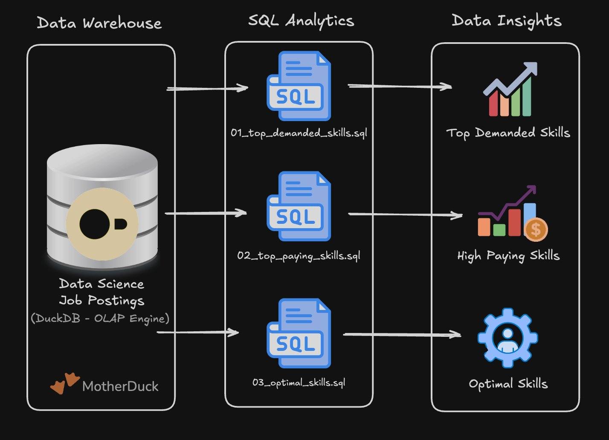
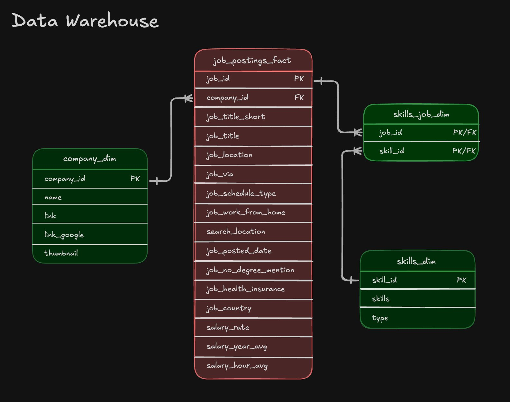
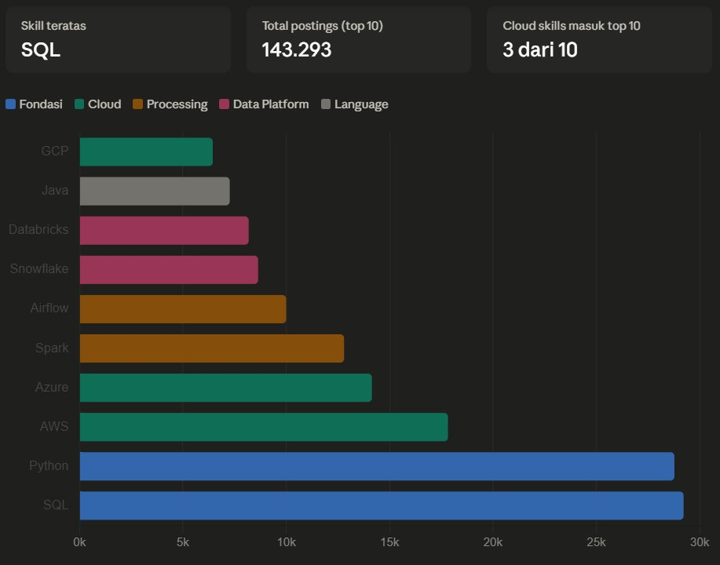
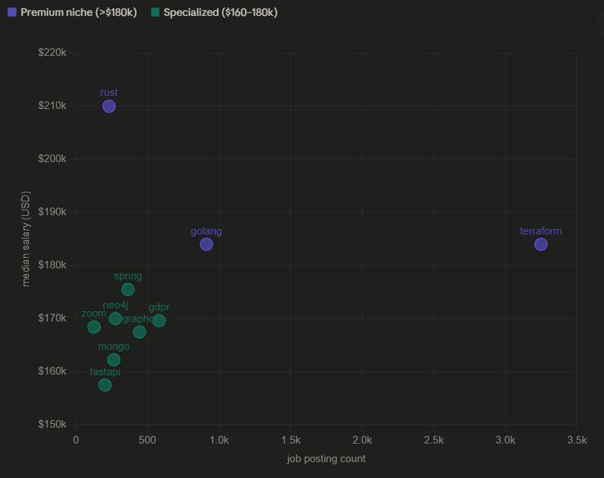
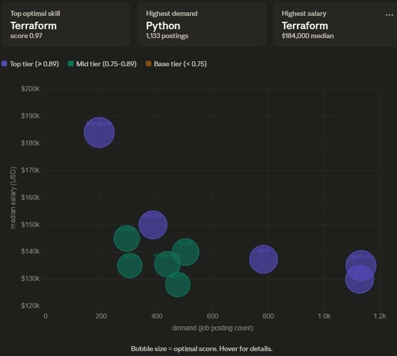

# Data Engineer Job Market Analysis

SQL-based analysis of 700K+ job postings to identify in-demand skills, salary trends, and optimal skill combinations for remote Data Engineer roles.

---

## Project Overview

This project answers a practical question: **what skills should a Data Engineer learn to maximize both employability and compensation in the remote job market?**

Rather than relying on opinion or trend articles, this analysis goes directly to the data — 700K+ real job postings queried with SQL across three focused analytical lenses.

---

## Project Architecture



The pipeline is straightforward: a DuckDB OLAP engine hosted on MotherDuck serves as the data warehouse, three SQL scripts each answer a distinct business question, and the results are interpreted as actionable data insights.

---

## Data Warehouse Schema



The schema follows a **star schema** pattern:

- `job_postings_fact` — central fact table containing all job posting records including salary, location, and remote work flags
- `skills_job_dim` — bridge table linking jobs to skills (many-to-many)
- `skills_dim` — skill dimension table with skill name and type
- `company_dim` — company dimension table

---

## Tech Stack

| Tool | Role |
|------|------|
| **DuckDB** | OLAP query engine — columnar storage optimized for analytical workloads |
| **MotherDuck** | Cloud-hosted DuckDB — serverless, no infrastructure required |
| **SQL** | Primary analysis language |
| **VS Code** | Development environment |

### Key SQL Techniques Used

**`MEDIAN()` instead of `AVG()` for salary**
Salary distributions are right-skewed — a handful of $500K outlier postings can inflate the average significantly. `MEDIAN()` returns the middle value, giving a more honest picture of what most companies actually pay.

```sql
ROUND(MEDIAN(jpf.salary_year_avg), 0) AS median_salary
```

**`LN()` for demand compression**
Raw demand counts range from ~100 to 29,000+. Multiplying raw count × salary would let Python (29K postings) completely dominate the score. `LN()` compresses the scale so demand and salary contribute more equally to the final score.

```sql
ROUND(LN(COUNT(jpf.*)) * MEDIAN(jpf.salary_year_avg) / 1_000_000, 2) AS optimal_score
```

**`PERCENT_RANK()` window function**
Used in the production-grade version of the optimal scoring. Assigns each skill a percentile position (0.0–1.0) relative to all other skills, making the score robust to outliers and interpretable to stakeholders.

```sql
PERCENT_RANK() OVER (ORDER BY demand_count) AS pct_demand
```

**CTEs (Common Table Expressions)**
Multi-step analyses are broken into readable, auditable stages using `WITH` clauses rather than deeply nested subqueries.

---

## Analysis

The project is divided into three SQL queries, each answering a different strategic question.

---

### Query 1 — Top In-Demand Skills

> *"What skills appear most frequently in remote Data Engineer job postings?"*

**Focus:** Raw demand volume. Identifies the skills you need just to get past screening.



**Key findings:**
- SQL and Python are near-identical in demand (~29K postings each) — both are non-negotiable baseline requirements
- AWS leads cloud platforms with nearly 3× more demand than GCP
- Airflow and Spark dominate the pipeline/processing layer
- Snowflake and Databricks signal the industry's shift toward cloud data warehouses and lakehouse architecture

---

### Query 2 — Highest-Paying Skills

> *"Which skills are associated with the highest median salary in remote Data Engineer roles?"*

**Focus:** Salary ceiling. Identifies premium skills that command top compensation.



**Key findings:**
- Rust tops the list at $210K median — rare but exceptional compensation for systems-level pipeline work
- Terraform and Golang both sit at $184K, reflecting infrastructure and platform engineering demand
- GDPR at $169K is the surprising outlier — compliance engineering commands technical-level pay
- Airflow (9,996 postings) pays $150K — high demand but not a salary differentiator on its own

---

### Query 3 — Optimal Skills (Demand × Salary Balance)

> *"Which skills offer the best combination of market demand and compensation?"*

**Focus:** Return on investment. Avoids skills that are either too niche or too commoditized.

Uses LN-weighted scoring:

```
optimal_score = LN(demand_count) × median_salary / 1_000_000
```



**Key findings:**
- Terraform ranks #1 despite only 193 postings — its $184K median is strong enough that `LN(193) × 184,000` beats `LN(1133) × 135,000` (Python)
- Python and SQL are neck-and-neck at scores 0.95 and 0.91 — both are safe bets
- Airflow and Spark appear in the top 6 — strong demand AND above-average salary
- Azure scores lower than AWS despite similar demand, explained entirely by a ~$9K salary gap

---

## Key Takeaways

| Priority | Skills | Rationale |
|----------|--------|-----------|
| Must-have foundation | SQL, Python | Required in virtually every posting |
| Cloud platform | AWS (then Azure) | Higher salary ceiling + broader demand |
| Pipeline tools | Airflow + Spark | Strong demand and above-average pay |
| Salary multiplier | Terraform | Highest ROI per skill — $184K median |
| Stretch goal | Kafka, Kubernetes | Growing demand in modern data infra |

---

## Skill Roadmap Based on Data

```
Stage 1 (get interviews)   →  SQL + Python
Stage 2 (get offers)       →  AWS + Airflow or Spark
Stage 3 (negotiate salary) →  Terraform + Kafka or Kubernetes
```

---

## Repo Structure

```
data-engineer-job-market-analysis/
│
├── queries/
│   ├── 01_top_demanded_skills.sql
│   ├── 02_top_paying_skills.sql
│   └── 03_optimal_skills.sql
│
├── images/
│   ├── architecture.png
│   ├── data_warehouse.png
│   ├── viz_demand.png
│   ├── viz_salary.png
│   └── viz_optimal.png
│
└── README.md
```

---

## Dataset

Job postings dataset sourced from real-world Data Science job postings (2023), containing 700K+ records across multiple job titles, locations, and salary ranges. Loaded into DuckDB via MotherDuck for cloud-based querying.
